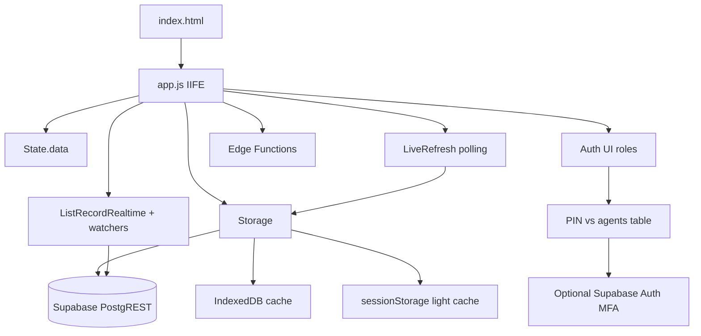
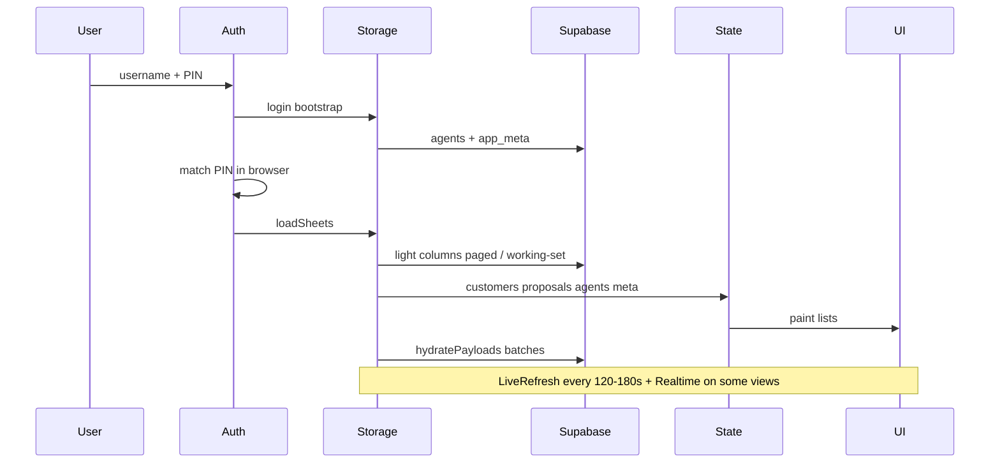

# דו״ח Audit ארכיטקטורת CRM — GEMEL INVEST

**תאריך:** 2026-09-13  
**ענף:** `cursor/crm-architecture-audit-7da4`  
**סטטוס:** Audit הושלם. **אין שינוי RLS / Auth / התנהגות CRM בקוד האפליקציה.**  
**אימות Production (R1):** בוצע מול PostgREST הציבורי (קריאה + בדיקות כתיבה מבוקרות). Supabase MCP לא זמין בסביבת Cloud Agent (`needsAuth` / אין interactive auth).

---

## א. הארכיטקטורה הקיימת

### מבנה כללי

מערכת SPA סטטית (ללא React/Next), בעברית RTL, מבוססת קבצי JS גדולים:

| רכיב | נתיב | תפקיד |
|------|------|--------|
| Shell + ניווט | [`index.html`](../index.html) | Login overlay, sidebar `data-view`, מסכי `#view-*` |
| ליבת CRM | [`app.js`](../app.js) (~82K שורות) | State, Storage, Auth, UI, מסכים |
| Wizard | [`gi-wizard.js`](../gi-wizard.js) | טעינה עצלה — רכישה חדשה |
| סימולטורים | [`gi-simulators.js`](../gi-simulators.js) | טעינה עצלה |
| Face login | [`gi-face-auth.js`](../gi-face-auth.js) | כניסה בפנים (קורא `agents` ללא session) |
| טפסים | `gi-*-form.js` + [`forms/`](../forms/) | מילוי PDF לפי חברה |
| Edge Functions | [`supabase/functions/`](../supabase/functions/) | Assistant + `gi-daily-sales-mail` |
| SQL תיעוד | `supabase-*.sql` | RLS/Storage — לא migration history מלא |

אין BFF. הלקוח מדבר ישירות עם PostgREST / Storage / Edge Functions דרך מפתח publishable שמוטמע ב־[`app.js`](../app.js) (שורות ~81–82).



### נקודות כניסה ואתחול

1. טעינת CDN `@supabase/supabase-js` + scripts.
2. `App.boot()` → bootstrap login (meta + agents בלבד).
3. Login: `Auth._submit` — השוואת username/PIN מול `agents` / `adminAuth`; MFA אופציונלי.
4. Pipeline אחרי login → `loadSheets` / delta → ציור UI → `hydratePayloads` → timers ברקע.
5. ניווט: `UI.goView(view)` — החלפת `.view.is-visible` (לא URL router).

### זרימת נתונים (ליבה)



**טבלאות מרכזיות** (`SUPABASE_TABLES` ב־`app.js` ~83–94):  
`app_meta`, `agents`, `customers`, `proposals`, `campaign_leads`, `gi_daily_report`, `gi_cancellations_report`, `gi_agent_appointment_report`, `gi_agent_activity_log`, `gi_simulator_saves`.

### מנגנוני טעינה

- **לקוחות:** עמודות רזות (`CUSTOMER_LIGHT_COLUMNS`) → `hydratePayloads` ברקע. מעל 5,000 לקוחות / מנהל צוות מעל ~400: working-set של 500 שורות (Large / TeamManager Light Session).
- **הצעות:** אותו דפוס עם `PROPOSAL_LIGHT_COLUMNS`; נציג תפעול מדלג על טעינת הצעות.
- **נציגים:** bootstrap לכניסה + sync מלא ב־`loadSheets`; **PIN נטען ל־State**.
- **לידים:** טעינת `campaign_leads` בעמודים עם `select("*")` עד תקרה גבוהה.
- **סקופ נציג בשרת:** `getServerListAgentScopeFilter()` — מסנן PostgREST לפי `agent_id`/`agent_name`; מוגדר במפורש כ־**superset**; השער הסופי הוא `filterSessionStateForCurrentUserScope()` בצד הלקוח.

### Cache

- **Server Only לליבה:** גיבוי מקומי מלא כמקור אמת בוטל; נשארים cache קצרים לביצועים (sessionStorage / IndexedDB).
- אין שימוש ב־localStorage כמקור אמת לנתוני CRM.

### סנכרון חי

- `LiveRefresh`: ~120s / ~180s — pull + re-render.
- Realtime לפי מסך (מושבת ב־Large/TM light).
- Watchers: שיוך הצעות, לידים (+ polling), צ׳אט, toasts תפעול/מראה.
- הגנות: מניעת wipe, שימור payloads, שער סנכרון כבד, דילוג בזמן Wizard/מודלים.
- מיזוג קונפליקטים: `Storage.mergeConflictRemoteTablesIntoState()` — בנתיב רגיל עלול למשוך `select("*")` מלא.

---

## ב. אימות RLS ב־Production (R1) — ממצאים חיים

בוצע ב־2026-09-13 עם מפתח ה־publishable מ־`app.js` בלבד (ללא session משתמש). סקריפט לאימות חוזר: [`scripts/r1-verify-anon-access.mjs`](../scripts/r1-verify-anon-access.mjs).

| משאב | גישת anon שנמדדה | סדר גודל | הערה |
|------|------------------|----------|------|
| `agents` | **SELECT** | ~58 | כולל עמודת **`pin` בטקסט גלוי** |
| `customers` | **SELECT + INSERT + UPDATE** | ~51,580 | DELETE החזיר 0 שורות; INSERT/UPDATE הצליחו |
| `proposals` | **SELECT** (+ PATCH מורשה ברמת בקשה) | ~257 | |
| `campaign_leads` | **SELECT** | ~5,054 | |
| `app_meta` | **SELECT** | 2 | |
| `gi_simulator_saves` | **SELECT** (+ INSERT עבר RLS עד NOT NULL) | 2 | תואם `using (true)` ב־SQL |
| `gi_daily_report` | **SELECT** | 5 | |
| `gi_cancellations_report` | **SELECT** | 1 | |
| `gi_agent_activity_log` | **SELECT** | ~32,586 | |
| `reminders` | **SELECT** (+ INSERT עבר RLS עד NOT NULL) | ~186 | |
| Storage `gi-customer-files` | **LIST** אובייקטים | — | תואם policy פתוחה ב־SQL |
| Edge `gi-daily-sales-mail` | **POST status ללא JWT משתמש** | — | החזיר מצב חיבור ומידע תפעולי |

**מסקנה R1:** האכיפה ב־DB **אינה** גבול אבטחה. כל מי שמחזיק את המפתח הציבורי (המוטמע ב־JS) יכול לקרוא ליבת CRM, לראות PIN־ים, ולכתוב לקוחות.

### שאריות בדיקה — חובה למחוק ידנית (service role)

נוצרה שורת בדיקה; DELETE ל־anon נחסם, ולכן השורה סומנה לארכיון:

```sql
-- להריץ ב-SQL Editor עם service role בלבד:
delete from public.customers where id = '__audit_probe_cust__';
```

סימנים לזיהוי: `full_name = '[AUDIT_PROBE_DELETE_ME]'`, `is_archived = true`.

---

## ג. בעיות קריטיות

### C1 — אכיפת הרשאות בעיקר ב־Frontend; DB פתוח ל־anon

**איפה:** [`supabase-customer-files-storage.sql`](../supabase-customer-files-storage.sql), [`supabase-simulator-saves.sql`](../supabase-simulator-saves.sql), סינון ב־`app.js` (`filterSessionStateForCurrentUserScope`, `Auth.is*`, `UI.goView`).

**למה קריטי:** מאומת ב־R1 — REST עם publishable key בלבד מחזיר לקוחות/נציגים/לידים.

### C2 — התחברות מבוססת PIN בצד הלקוח + PINs במצב בזיכרון

**איפה:** `Auth._submit`; מיפוי agents כולל `pin`; ברירות מחדל בקוד (`adminAuth.pin = "1234"`, PIN נציג `"0000"`, `ARCHIVE_CUSTOMER_PIN = "1990"` בשורה ~80 ב־`app.js`).

**למה קריטי:** R1 הוכיח ש־`agents.pin` נשלף ב־SELECT ל־anon.

### C3 — Edge Functions עם `verify_jwt = false`

**איפה:** [`supabase/config.toml`](../supabase/config.toml). בדיקת `gi-daily-sales-mail` action `status` החזירה מידע תפעולי ללא JWT משתמש.

### C4 — מדיניות proposals מבוססת JWT לא מכסה את רוב המשתמשים

**איפה:** [`supabase-proposals-rls-fix.sql`](../supabase-proposals-rls-fix.sql) — ל־`authenticated` + שימוש גם ב־`user_metadata`. משתמשי PIN־only נשארים על anon.

### C5 — סיכון דריסת נתונים בסנכרון מרובה־לקוחות

**איפה:** `LiveRefresh`, `mergeConflictRemoteTablesIntoState`, שמירות מקבילות מ־Wizard / עריכת לקוח / תהליכים.

---

## ד. בעיות ביצועים

| צוואר בקבוק | איפה | סיבה |
|-------------|------|------|
| P1 — מונולית `app.js` ~4MB | כל טעינת דף | Parse/compile ארוך; תחזוקה קשה |
| P2 — טעינת רוסטר בסשן רגיל | `loadSheets` | מתחת ל־5K עדיין paging מלא בסקופ + hydrate ברקע |
| P3 — `hydratePayloads` ברקע | מנות | תחרות על רשת/CPU בזמן עבודה |
| P4 — conflict merge עם `select("*")` | `mergeConflictRemoteTablesIntoState` | מושך טבלאות מלאות עם payload |
| P5 — לידים `select("*")` | Campaign leads loader | אלפי שורות מלאות (~5K כיום) |
| P6 — LiveRefresh + Realtime + watchers | Background timers | חפיפת pull/render |
| P7 — `normalizeState` חוזר | סנכרונים | ריצות מרובות על אותן רשומות |
| P8 — רנדור טבלאות בזיכרון | Customers / Proposals UI | גדל לינארית עם מספר רשומות ב־State |
| P9 — ניווט בין מסכים | `goView` + realtime | עלות ערוצים/רענון |

**מה כבר מטופל היטב (לשמר):** Light columns, Large Session / TM Light, working-set 500, דילוג hydrate בזמן אינטראקציה, KPI דרך RPC כשחסרים payloads, Server Only לליבה.

---

## ה. בעיות ארכיטקטורה

1. מונולית יחיד — State/Storage/Auth/UI/Domain באותו IIFE.
2. אחריות מעורבבת — אבטחה ב־UI, סינון ב־client, DB פתוח.
3. כפילות תחבורה — supabase-js + REST fallback; כפילות URL/key במספר קבצים.
4. כפילות טפסי ביטוח — עשרות loaders דומים.
5. מודל Auth כפול — PIN מקומי מול Supabase Auth MFA.
6. צמיחה — ~51K לקוחות כבר ב־Production; מצבי Large Session קריטיים.
7. אין `supabase/migrations` מסודרות — רק SQL ad-hoc.

---

## ו. המלצות וסדר עדיפויות

פירוט יישומי: [`CRM_REMEDIATION_ROADMAP.md`](CRM_REMEDIATION_ROADMAP.md).

1. **קריטי:** R1 (הושלם כאן) → תכנון R9-pre / R2 Auth+RLS → R3 Storage → R4 Edge → R5 ברירות מחדל חלשות  
2. **חשוב:** R6 select צר, R7 איחוד סנכרון, R8 hydrate on-demand, R9 הסתרת PIN  
3. **עתידי:** R10–R14 (פיצול מבוקר, API אחיד, migrations, ייבוש טפסים, server-backed lists)

---

## ז. כללי המשך

- דו״ח זה **לא** משנה RLS / APIs / UI.
- כל תיקון עתידי: מינימלי, ממוקד, עם אישור מפורש (במיוחד לפני הפעלת RLS — אחרת המערכת עלולה להינעל כי Login הוא PIN על anon).
- Server Only לליבת CRM; לא להחזיר localStorage כמקור אמת.
- לא Refactor גלובלי, לא CSS/RTL גורף, לא שינוי UX ללא אישור.
