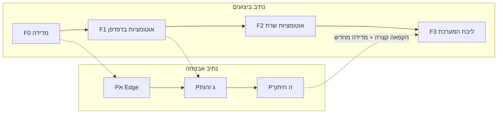

# תוכנית ביצועים — מערכת + אוטומציות

**סוג מסמך:** נתיב עבודה מקביל לתוכנית האבטחה. לא יישום.  
**אישור משתמש:** 2026-09-13 — להכניס לתוכנית שיפור ביצועי האוטומציות והמערכת עצמה.  
**כפוף ל:** [`CRM_SECURITY_PROGRAM.md`](CRM_SECURITY_PROGRAM.md)  
**בסיס:** צווארי בקבוק P1–P9 ב־[`CRM_ARCHITECTURE_AUDIT.md`](CRM_ARCHITECTURE_AUDIT.md) + קוד חי.

---

## 1. איך זה נכנס לתוכנית בלי לדרוס אבטחה

שני נתיבים רצים **במקביל**, לא בתור. אבטחה לא מחכה לביצועים; ביצועים לא מחכים לחיתוך RLS.

**כלל הזהב:** PR ביצועים לא נוגע ב־RLS, grants, Auth, PIN, Edge auth, או מסך כניסה.  
PR אבטחה לא “מסדר ביצועים” באותו שינוי.

בשבוע חיתוך **Pה** נתיב הביצועים **מוקפא** — אחרת לא נדע אם תקיעה היא RLS או שינוי sync.

---

## 2. מה כבר מהיר — לא לגעת

לשמר, לא לשכתב:

- עמודות רזות ללקוחות/הצעות (`CUSTOMER_LIGHT_COLUMNS` / `PROPOSAL_LIGHT_COLUMNS`)
- Large Session / Team Manager Light + working-set 500
- דילוג `hydratePayloads` / `LiveRefresh` בזמן הקלדה, Wizard, מראה, מודלים
- KPI דשבורד דרך `gi_dashboard_*` כשחסר payload
- Server Only לליבה (לא להחזיר localStorage כמקור אמת)
- `giPerfReport()` בקונסול — כלי המדידה הקיים

---

## 3. שני סוגי “איטי”

| סוג | מה המשתמש מרגיש | מקור עיקרי |
|-----|-------------------|------------|
| **המערכת** | כניסה ארוכה, רשימות כבדות, מעבר מסך תקוע, שמירה איטית | `app.js` ~4MB, `loadSheets`, `normalizeState`, רנדור טבלאות, `select("*")` |
| **אוטומציות** | המסך “קופץ” לבד, רשת תפוסה בזמן עבודה, מייל יומי מאחר, ברקע רץ בלי הפסקה | `LiveRefresh` 120/180 שנ׳, Realtime, watchers 2.5 שנ׳, `hydratePayloads`, כרון מייל כל 10 דק׳, Assistant pull |

אוטומציה כאן = כל דבר שרץ **בלי לחיצה**: טיימרים, Realtime, כרונים, hydrate רקע, שעוני GitHub, עוזר.

---

## 4. מלאי אוטומציות חי (נקודת התחלה ל־F0)

| אוטומציה | איפה | קצב / טריגר | למה זה כבד | נתיב |
|----------|------|-------------|------------|------|
| `LiveRefresh` | `app.js` | 120 שנ׳ / 180 שנ׳ למנהל; דשבורד force כל 7 דק׳ | pull + `normalizeState` + ציור מחדש; חופף ל־Realtime | F1 |
| Realtime + list watchers | לפי מסך | אירועי טבלה | כבוי ב־Large/TM light; במסך רגיל עלול לכפול את ה־pull | F1 |
| Assign / chat / referral watchers | `app.js` | חלקם כל 2.5 שנ׳ | polling גם כשהמסך לא רלוונטי | F1 |
| `hydratePayloads` | אחרי login | מנות ברקע | מתחרה על רשת/CPU בזמן עבודה | F1 |
| `ReferralQuietRefresh` | אחרי ניווט | idle | עוד pull שקט | F1 |
| מייל מכירות יומי | GitHub Action → Edge | `*/10` + 12:30 / 15:00 / 20:00 שעון ישראל | סקר כל 10 דק׳ (נחוץ כי cron מאחר); snapshot נבנה בצד הלקוח ממודל הדוח | F2 + Pא (auth לחוד) |
| Assistant `pull` / pairing | Edge | לפי מכשיר | service role + סבבי pull | F2, בלי לשנות auth באותו PR |
| כניסת פנים / רכב | Edge | לפי בקשה | לא צוואר ביצועים ראשון | מחוץ לגל הראשון |

הכרון של המייל **לא** יוחלף ב־`verify_jwt` במסגרת ביצועים. אבטחה שלו = Pא.

---

## 5. יעדי שירות (SLO) — נמדוד ב־F0, נשפר אחר כך

מספרים אלה הם **יעד תכנון**, לא הבטחה בלי מדידה. F0 ממלא בסיס אמיתי מ־`giPerf` + פעם אחת עם מנהל ופעם עם נציג.

| מסלול | יעד אחרי שיפור | איך מודדים |
|--------|-----------------|------------|
| אחרי PIN עד דשבורד שמיש | ירידה מול הבסיס שנמדוד; בלי לחכות ל־hydrate מלא | `giPerf` + שעון ידני |
| רשימת לקוחות (נציג) | גלילה/חיפוש בלי הקפאת UI | אינטראקציה + `giPerf` |
| רשימת מנהל / Large Session | נשאר working-set; לא חוזרים לרוסטר מלא בזיכרון | ספירת שורות ב־State |
| אוטומציות בזמן הקלדה/מראה | אפס pull כבד | לוגי `LIVE_REFRESH` / hydrate לא רצים |
| מייל 12:30/15:00/20:00 | שליחה באותו חלון שעה, בלי כפילות | לוג Edge + GitHub Action |
| לידים | בלי `select("*")` על ~5K | רשת |

אין פיצול `app.js` ואין virtualization של טבלאות בגל הראשון (זה UI/ארכיטקטורה — R10, דורש אישור נפרד).

---

## 6. הפאזות

### F0 — מדידה (אפשר להתחיל מיד, אפס סיכון למוצר)

בלי לשנות התנהגות:

1. רשימת טיימרים פעילים אחרי login (שם, interval, תנאי `shouldRun`).
2. צילום `giPerfReport()`: כניסת מנהל, כניסת נציג, פתיחת לקוחות, דשבורד, בניית snapshot מייל.
3. סימון אילו watchers רצים גם ב־`document.hidden`.

שער יציאה: טבלת בסיס במסמך / PR מדידה. בלי זה אין “שיפרנו”.

### F1 — אוטומציות בדפדפן (הרווח שהמשתמש מרגיש קודם)

מותר במקביל ל־Pא/Pב/Pג/Pד. PR אחד לכל תת־נושא.

1. **מקור סנכרון אחד למסך פעיל.** LiveRefresh + Realtime + watcher לא מושכים את אותה טבלה באותו מחזור. אחד מוביל; השניים האחרים יושבים.
2. **Backoff אחיד.** טאב מוסתר / לא המסך הרלוונטי / מראה פתוח → אין polling של שיוך/צ׳אט/לידים.
3. **`hydratePayloads` רק למה שפתוח או לראש ה־working-set.** לא להשלים 51K ברקע אצל מנהל.
4. **לידים בלי `select("*")`.** עמודות רשימה + payload לפי תיק פתוח (אותו דפוס של לקוחות).
5. **`mergeConflictRemoteTablesIntoState` בלי `select("*")` מלא.**

שער יציאה:

- בזמן הקלדה/Wizard/מראה אין pull כבד בלוג.
- לידים ו־conflict לא גוררים שורות מלאות.
- כניסה + רשימה + מראה + דשבורד נבדקו ידנית.

סיכון: נתונים “לא חיים מספיק” אם מרחיקים refresh יותר מדי. לכן משנים קצב/תנאי, לא מוחקים את LiveRefresh.

### F2 — אוטומציות שרת / כרון

1. מייל יומי: **לא** לשנות את סקר 10 הדקות בלי תחליף אמינות (כבר נכבה פעם אחרי כשלונות schedule). שיפור מותר: פחות עבודה ב־`send-slot` כשאין slot, לוג ברור יותר, snapshot כבד לא ב־UI thread אם אפשר בלי לשנות פלט המייל.
2. Assistant: הורדת תדירות `pull` כשאין session פתוח; בלי להחליף PIN/device auth.
3. אסור באותו PR: `verify_jwt`, secrets חדשים, שינוי שעון 12:30/15:00/20:00.

שער יציאה: שלושת הסלוטים עברו ביום בדיקה; עוזר עדיין נפתח.

### F3 — ליבת המערכת (אחרי F0+F1, או פריט בודד אם F0 מראה שזה הצוואר)

1. איחוד `normalizeState` — לא שלוש ריצות על אותן רשומות בסנכרון אחד (כבר יש `preMapped`; להשלים חורים).
2. היצרות select שנשאר רחב (חוץ מלידים שכבר ב־F1).
3. שמירת working-set למנהל; לא להחזיר טעינת 51K payloads לפתיחה.
4. מעבר מסך: לא לחבר/לנתק Realtime מיותר ב־`goView`.

שער יציאה: אותם מסכים כמו F1 + שמירת תיק + Large Session לא נשבר.

**מחוץ לגל הזה:** פיצול המונולית, עיצוב מחדש, virtual DOM, החלפת Wizard.

### F4 — אחרי חיתוך אבטחה (Pה)

RLS מצמצם עלול **להאט** שאילתות (ולפעמים להאיץ כי פחות שורות). אחרי Pה:

- מודדים מחדש F0
- מוסיפים אינדקסים רק לפי תוכנית שאילתה אמיתית
- רק אז שוקלים רשימות server-backed (R10)

---

## 7. מה אסור בנתיב הביצועים

1. לשנות RLS / grants / PIN / Auth / Edge auth.
2. להחזיר localStorage כמקור אמת.
3. Refactor “סדר” של `app.js` או CSS/RTL.
4. לבטל את סקר המייל `*/10` בלי מנגנון אחר שעובד כש־GitHub מאחר.
5. להריץ F1/F2/F3 באותו שבוע של חיתוך Pה.
6. להבטיח SLO לפני שיש בסיס F0.

---

## 8. סדר יישום מומלץ אחרי האישור הזה

| תור | פריט | מקביל ל |
|-----|------|----------|
| עכשיו | **F0 מדידה** | Pא (אם יאושר בנפרד) |
| אחרי F0 | **F1.1** מקור סנכרון אחד + backoff ל־watchers | Pא–Pד |
| אחר כך | **F1.2** לידים + conflict בלי `select("*")` | Pא–Pד |
| אחר כך | **F1.3** hydrate רק ל־working-set | Pא–Pד |
| לפי צורך | F2 מייל/עוזר — התנהגות בלבד | לא באותו PR של Pא |
| אחרי F1 | F3 normalize / goView | לא ב־Pה |
| אחרי Pה | F4 מדידה + אינדקסים | — |

הצעד הביצועי הראשון ליישום, כשתבקש להתחיל: **F0 בלבד** (מדידה). בלי לשנות מוצר.
