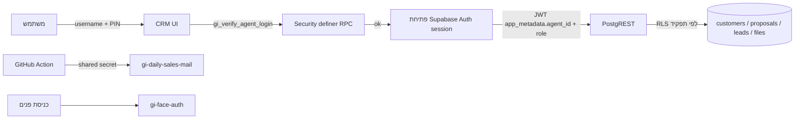
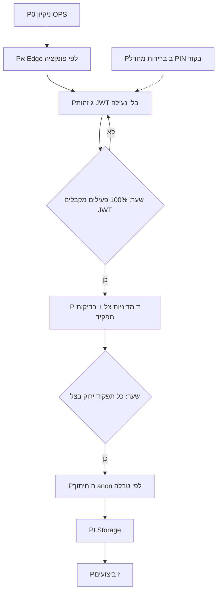

# תוכנית אבטחה מדורגת — GEMEL INVEST CRM

**סוג מסמך:** תכנון החלטות (Decision plan). לא סקריפט הרצה.  
**תאריך:** 2026-09-13  
**בסיס עובדות:** Production `vhvlkerectggovfihjgm` + [`CRM_ARCHITECTURE_AUDIT.md`](CRM_ARCHITECTURE_AUDIT.md) + אימות R1 חי.  
**סטטוס:** **אין שינוי DB / RLS / Edge / Auth במסמך זה.** כל פאזה דורשת אישור מפורש לפני קוד.

---

## 1. למה צריך תוכנית, לא “נתחיל לנעול”

ה־CRM הוא SPA סטטי שרץ מול Supabase **כ־`anon`**. PIN הוא שער ב־UI, לא גבול ב־DB.

RLS **כבר דלוק** כמעט על כל הטבלאות. זה לא עוזר: רוב ה־policies הן `USING (true)` ל־`anon`/`authenticated`/`public`. כלומר “RLS enabled” היום הוא תיאטרון, לא הגנה.

לכן “להפעיל RLS” **אינו** הצעד הבא. הצעד הוא לבנות זהות אמיתית, ואז להחליף policies פתוחות ב־policies שתואמות את התפקידים שכבר חיים ב־UI — בלי לנעול את 57 המשתמשים הפעילים.

---

## 2. מצב נוכחי (עובדות, לא הנחות)

### 2.1 מה כבר נסגר

| פריט | מצב |
|------|-----|
| R1 — מדידת חשיפת anon | הושלם. הסקריפט: `scripts/r1-verify-anon-access.mjs` |
| R9-pre-A — `gi_verify_agent_login` | חי בפרודקשן. כניסה דרך RPC |
| R9-pre-B — הסתרת `agents.pin` | חי בפרודקשן. `SELECT pin` / `SELECT *` על `agents` נחסמים ל־anon. כניסה לא תלויה בשליפת PIN |

### 2.2 מה עדיין פתוח לכל מי שמחזיק את המפתח הציבורי

המפתח מוטמע ב־`app.js`. עם REST בלבד, בלי התחברות:

- קריאה + כתיבה ל־`customers` (~51,580 שורות; INSERT/UPDATE הצליחו ב־R1)
- קריאה ל־`proposals`, `campaign_leads`, `app_meta`, דוחות, לוג פעילות
- LIST ל־Storage `gi-customer-files`
- Edge `gi-daily-sales-mail` action `status` בלי JWT — מחזיר מצב חיבור/נמענים

`DELETE` ל־anon חסום בחלק מהטבלאות. זה לא מספיק: קריאה וכתיבה של ליבה פתוחות.

### 2.3 זהות בפרודקשן (נמדד 2026-09-13)

| מדד | מספר |
|-----|------|
| נציגים סה״כ / פעילים | 58 / 57 |
| פעילים עם `auth_user_id` | 43 |
| פעילים בלי `auth_user_id` | **14** |
| פעילים עם אימייל בטבלת agents | **9 בלבד** |
| לקוחות עם `agent_id` / בלי | 51,458 / **122** |

פעילים בלי קישור Auth, לפי תפקיד:

| role | בלי `auth_user_id` |
|------|---------------------|
| opsAgent | 8 (כל נציגי התפעול) |
| ops | 1 |
| referent | 1 |
| agent | 2 |
| elementary | 2 |
| manager / teamManager | 0 |

**מסקנה:** חיתוך RLS לפי JWT היום היה נועל את כל התפעול, את הסוקרת, וחלק מהנציגים/אלמנטרי — גם אם המנהלים כבר מקושרים.

### 2.4 תפקידים חיים ב־UI (המקור ל־RLS היעד)

השער האמיתי היום הוא `Auth.*` + `filterSessionStateForCurrentUserScope()` בצד הלקוח.

| תפקיד | משתמשים פעילים | לקוחות ב־UI | הערת שרת |
|--------|-----------------|-------------|----------|
| admin / owner / manager | 5 מנהלים (+ admin מ־`adminAuth`) | הכל | `canViewAllCustomers()` |
| ops | 1 | הכל | כמו מנהל לנתוני לקוחות |
| opsAgent | 8 | הכל ברשימה; מראה מסונן בנפרד | `getServerListAgentScopeFilter()` מחזיר `null` — כלומר **השרת לא מצמצם** |
| teamManager | 4 | עצמי + צוות מ־`teamManagerAssignments` / `team_manager_id` | פילטר שרת לפי id/שם של הצוות (superset) |
| agent | 31 | תיקים בבעלות עצמית | פילטר שרת לפי id/שם |
| elementary | 7 | בריכת אלמנטרי | לפי `agent_role` |
| referent | 1 | לידים + סקופ ייעודי | לא מודל `agent_id = self` |

אי אפשר להעתיק את מדיניות `proposals_select_own` (`agent_id = jwt`) על `customers` ולצפות שהמערכת תעבוד. התפעול והאלמנטרי **ייעלמו**.

### 2.5 Edge Functions (כולן `verify_jwt = false`)

| פונקציה | אימות פנימי היום | סיכון עיקרי |
|---------|-------------------|-------------|
| `gi-daily-sales-mail` | אין על `status` / `send-now` / `save-azure` | מידע תפעולי + שליחת מייל |
| `gi-assistant-*` | PIN בגוף הבקשה או device secret; רצה עם service role | PIN עדיין נוסע בבקשה; service role עוקף RLS |
| `gi-face-auth` | נפרד, בלי JWT משתמש | חייב מסלול כניסה בלי session |
| `gi-gov-vehicle` | פרוקסי חיצוני | צריך גבול מי קורא |

GitHub Action הוא השעון של המייל היומי (`--no-verify-jwt`). הפעלת `verify_jwt=true` גלובלית **תשבור את הכרון**.

### 2.6 חוב טכני שחוסם נעילה נקייה

1. `gi_jwt_is_manager()` / `gi_jwt_agent_id()` קוראים גם `user_metadata` — ב־Supabase זה **ניתן לעריכה ע״י המשתמש**. אסור לבסס עליו הרשאה.
2. ב־`proposals` יש כבר policies “own” ל־`authenticated`, **ומעליהן** policies פתוחות ל־anon (`gi_proposals_*_public`, `anon_read_proposals`). הצרות מנוטרלות ע״י הרחבות.
3. Assistant Edge עדיין עושה `select id,...,pin` עם **service role** — לכן R9-pre-B לא שבר אותו, אבל PIN נשאר סוד צד־שרת שם.
4. כניסת פנים / רשימת משתמשים / בוטסטרפ לוגין עדיין צריכים קריאת עמודות ציבוריות של `agents` (בלי pin).

---

## 3. מודל איום

| תוקף | מה הוא יכול היום | מה התוכנית סוגרת, ובאיזו פאזה |
|-------|-------------------|--------------------------------|
| כל אחד עם המפתח מ־JS | קריאת/עדכון לקוחות, לידים, מטא, קבצים | פאזה E (חיתוך anon) — **רק אחרי** פאזה C+D |
| קורא `app.js` | יודע `1234` / `0000` / `1990` | פאזה B (R5) — משני |
| קורא Edge בלי JWT | סטטוס מייל יומי, שליחה, חיבור Azure | פאזה A (R4) |
| נציג לגיטימי עם PIN גנוב | כל מה שה־UI שלו פותח; וגם מעקף UI דרך REST | פאזה E מצמצמת ל־JWT+סקופ; PIN גנוב עדיין מסוכן עד MFA |
| משתמש Auth שמשנה `user_metadata` | אם נישען על ה־helpers הקיימים — הרמת הרשאה | פאזה C מתקנת helpers **לפני** כל הסתמכות |

גבול היעד: **הדפדפן מחזיק JWT. Postgres מחליט לפי `app_metadata` + טבלת `agents`. PIN נשאר UX, לא מפתח REST.**

---

## 4. ארכיטקטורת יעד (בלי לשבור את מוצר הכניסה)

עקרונות יעד:

1. **כניסת האדם לא משתנה** בשלב הראשון: שם + PIN (או פנים). מאחורי הקלעים נוצר session.
2. הרשאות רק ב־`raw_app_metadata` (לא `user_metadata`).
3. מיפוי יציב: `agents.auth_user_id` ↔ `auth.users.id`, ו־`app_metadata.agent_id/role` מסונכרן מטבלת `agents` (מקור האמת לתפקיד).
4. `anon` נשאר רק למה שחייב לפני session: RPC כניסה, אולי רשימת usernames ציבורית, OAuth callback, face challenge.
5. Edge: אימות **לפי פונקציה**, לא מתג אחד. כרון ≠ משתמש.

---

## 5. מטריצת הרשאות יעד (DB חייב לשקף UI)

| משאב | admin / manager | ops | opsAgent | teamManager | agent | elementary | referent | anon אחרי חיתוך |
|-------|-----------------|-----|----------|-------------|-------|------------|----------|-------------------|
| `customers` | הכל | הכל | הכל (כמו היום בשרת) | עצמי+צוות | עצמי | בריכת אלמנטרי | לפי כלל ייעודי, לא “הכל” אלא אם יוחלט אחרת | אין |
| `proposals` | הכל | אין צורך מוצרי (היום מדלגים בטעינה) | אין צורך מוצרי | עצמי+צוות | עצמי | אין | אין | אין |
| `campaign_leads` | הכל | לפי צורך תפעולי | מוגבל | מוגבל | לידים משויכים | אין | תיבת לידים | אין |
| `agents` ציבורי | הכל בלי pin | בלי pin | בלי pin | בלי pin | בלי pin | בלי pin | בלי pin | לכל היותר id,name,username,role,active — או אפס, אם הבוטסטרפ עובר ל־RPC |
| `agents.pin` | אף אחד דרך REST | — | — | — | — | — | — | אין (כבר) |
| `app_meta` | מנהלים | חלקי | חלקי | חלקי | מינימום | מינימום | מינימום | אין אחרי חיתוך |
| Storage קבצי לקוח | לפי סקופ הלקוח | לפי סקופ | לפי סקופ | לפי סקופ | תיקי עצמי | תיקי בריכה | לפי החלטה | אין |
| `gi_simulator_saves` | בעלים / מנהל | — | — | — | בעלים | — | — | אין |

**החלטה פתוחה (חובה לפני פאזה D):** האם `opsAgent` באמת צריך `SELECT` על כל `customers` ב־DB, או שזה מצב זמני כי הפילטר בשרת כבוי? ה־UI טוען הכל ואז מסנן מראה. נעילה “לפי שיוך מראה בלבד” תשבור מסכים אם לא נמפה את כלל המראה ל־SQL.

---

## 6. חוקי ביצוע (לא לסטות)

1. **Additive first.** מוסיפים מסלול session. לא סוגרים anon באותו PR.
2. **שער (gate) לפני כל נעילה.** בלי מדידה — אין revoke.
3. **אין Refactor של `app.js`, אין UI/CSS/RTL, אין החזרת localStorage כמקור אמת.**
4. **אין `ENABLE RLS` כפעולה** — הוא כבר דלוק. העבודה היא החלפת policy.
5. **אין `verify_jwt=true` גלובלי.**
6. **Helpers של JWT בלי `user_metadata` לפני שמישהו נשען עליהם.**
7. לכל נעילה: קובץ rollback SQL **מוכן מראש** (שחזור policy `USING (true)` לטבלה הספציפית).
8. לא נוגעים בטפסי ביטוח / Hachshara / Wizard במסגרת התוכנית הזו.

---

## 7. הפאזות

Pב יכול לרוץ במקביל ל־Pא. **אסור** ש־Pה יתחיל לפני Pג+Pד.

### P0 — ניקיון (סיכון נמוך)

מחיקת `__audit_probe_cust__` ב־SQL Editor עם service role.

- **נותן:** מסיר רשומת בדיקה שנשארה כי DELETE ל־anon נחסם.
- **לא נותן:** שום הגנה.
- **פגיעה:** אין, אם מוחקים רק את ה־id הזה.
- **אישור:** חד־פעמי, service role.

### Pא — Edge (R4) — הפריט החשוב הבא שמותר לגעת בו בלי RLS

לא “מדליקים JWT על הכל”. לכל פונקציה גבול משלה.

| פונקציה | כיוון מומלץ | מה עלול להישבר אם טועים |
|---------|-------------|--------------------------|
| `gi-daily-sales-mail` | `send-slot` רק עם shared secret של GitHub Action; פעולות UI (`status`/`send-now`/`save-azure`) רק אחרי אימות actor (PIN-RPC או JWT מנהל) | מייל 12:30/15:00/20:00; מסך חיבור Outlook |
| `gi-assistant-*` | להשאיר device/PIN; **לא** `verify_jwt=true` עד שיש session לכולם; להפסיק `select pin` כשאפשר ולאמת דרך RPC קיים | עוזר קולי / צימוד מכשיר |
| `gi-face-auth` | נשאר בלי JWT משתמש; סוד ייעודי או challenge | כניסת פנים |
| `gi-gov-vehicle` | מפתח/session קורא | שליפת רכב |

שער יציאה מ־Pא:

- כל action מתועד: מי מורשה, איך, מה קורה ב־401.
- כרון המייל עובר אחרי השינוי.
- Rollback = deploy קודם / כיבוי בדיקת הסוד בדגל.

### Pב — ברירות מחדל בקוד (R5) — משני, לא על הנתיב הקריטי

הסרת `1234` / `0000` / `1990` מה־JS הפועל.

- **נותן:** מי שקורא את הקוד לא מקבל קודי־על מוכנים; משתמש חדש לא נולד עם `0000`.
- **עלול לפגוע:** כניסת מנהל אם מישהו עדיין על `1234`; ארכיון אם עדיין על `1990`; יצירת משתמש אם הטופס דורש PIN ולא ממלאים.
- **לא קריטי** מול חשיפת 51K לקוחות.
- רץ רק אחרי מיפוי מי באמת משתמש בערכים האלה, ובלי לשנות UX מעבר להסרת prefill.

### Pג — זהות (R2 זהות) — בלי לסגור anon

זו הפאזה שקובעת אם נעילה אפשרית. המוצר נשאר כמו היום אם JWT נכשל.

עבודות:

1. תיקון `gi_jwt_agent_id` / `gi_jwt_is_manager` ל־`app_metadata` + lookup ל־`agents.auth_user_id`. בלי `user_metadata`.
2. הקמת משתמשי Auth ל־14 הפעילים החסרים (כל ה־opsAgent קודם — אחרת תפעול יינעל בחיתוך).
3. אחרי `gi_verify_agent_login` מצליח: פתיחת session Auth **בלי לשנות מסך הכניסה**. דפוס קיים כבר ב־MFA (אימייל + PIN כסיסמה) — להרחיב בזהירות, או סיסמה אקראית + sign-in מצד שרת (Edge security definer), לפי החלטת מימוש **באישור נפרד**.
4. סנכרון `app_metadata`: `{ agent_id, role }` מטבלת `agents` בכל שינוי תפקיד.
5. טלמטריה שקטה: `login_source=server` + `session=jwt|anon`.
6. תיקון 122 לקוחות בלי `agent_id` (כללי בעלות: לא לשייך אוטומטית בלי כלל עסקי).

שער יציאה מ־Pג — **כולם חובה:**

- 57/57 פעילים מצליחים לקבל JWT אחרי כניסת PIN רגילה.
- אף מסך ליבה לא דורש JWT כדי לעבוד (עדיין anon).
- helpers לא קוראים `user_metadata`.
- יש דוח: מי נכנס עם JWT בשבוע מדידה.

אם השער נכשל — **עוצרים. אין Pד/Pה.**

### Pד — מדיניות צל (R2 צל) — עדיין בלי revoke ל־anon

כותבים את ה־policies **היעד** ל־`authenticated` לפי המטריצה בסעיף 5.  
משאירים את `USING (true)` ל־anon.

בודקים מול JWT אמיתי של כל תפקיד (staging / Supabase branch, לא ניחוש):

- נציג רואה רק את התיקים שלו.
- מנהל צוות רואה צוות (צריך ייצוג SQL ל־`team_manager_id` + assignments).
- ops רואה הכל.
- opsAgent: לפי ההחלטה בסעיף 5.
- elementary / referent: לפי כלל מפורש, לא “כמו נציג”.

שער יציאה מ־Pד:

- מטריצת בדיקות ירוקה לכל תפקיד.
- אין הסתמכות על policy ישנה של `CURRENT_USER` / `username`.
- קובץ rollback לכל טבלה מוכן.

### Pה — חיתוך anon (R2 חיתוך) — היחיד שיכול להפיל את העסק

רק אחרי שערי Pג+Pד. **טבלה־טבלה**, לא “כל ה־public”.

סדר חיתוך מומלץ (blast radius עולה):

1. טבלאות היסטוריה/גיבוי שלא ב־hot path
2. דוחות (`gi_daily_report`, ביטולים, activity log)
3. `campaign_leads`
4. `proposals` (יש כבר שלד own — קודם מנטרלים את ה־public overlay)
5. `customers` — האחרון בליבה
6. `app_meta`
7. צמצום נוסף של `agents` אם הבוטסטרפ כבר RPC־only

לכל טבלה:

- PR נפרד
- בדיקת כניסה + רשימה + שמירה + Realtime/LiveRefresh של המסך הרלוונטי
- kill switch: החזרת policy קריאה ל־anon תוך דקות

אם כניסה או רשימת לקוחות נשברת — מדליקים kill switch, לא “מתקנים מעל פרודקשן שבור”.

### Pו — Storage (R3)

רק אחרי ש־`customers` כבר חתוך לפי JWT.  
Policy על `storage.objects` לפי בעלות הלקוח (או prefix `customer_id`).  
היום: `gi_customer_files_all` פתוח ל־anon/authenticated על כל ה־bucket.

### Pז — ביצועים (R6–R8)

רק אחרי שהגבול יציב, או במקביל **אם** לא נוגעים ב־policies.  
select צר, איחוד sync, hydrate לפי צורך. לא תחליף אבטחה.

R10–R14 (פיצול מונולית, migrations סדורות, ייבוש טפסים) — מחוץ לתוכנית האבטחה.

---

## 8. מה אסור לעשות עכשיו

1. להחליף `USING (true)` על `customers` / `agents` / `app_meta` לפני שער Pג.
2. להעתיק את policies של `proposals` על `customers`.
3. `verify_jwt=true` על `gi-daily-sales-mail` בלי מסלול secret לכרון.
4. לבסס role על `user_metadata`.
5. לנעול Storage לפני חיתוך `customers`.
6. Refactor, עיצוב מחדש, או שינוי מסך כניסה “כדי שיהיה Auth”.

---

## 9. שערי אישור — מה צריך ממך לפני קוד

| החלטה | למה זה חוסם | ברירת מחדל מומלצת אם לא נאמר אחרת |
|--------|-------------|-------------------------------------|
| להתחיל ב־**Pא (Edge / מייל יומי)** ולא ב־R5 | רווח אבטחה אמיתי בלי לגעת ב־RLS | כן, Pא קודם |
| האם `opsAgent` רואה את כל הלקוחות גם ב־DB אחרי נעילה | קובע את SQL של Pד/Pה | כן, כמו היום בשרת — עד שנגדיר מראה ב־SQL |
| האם PIN נשאר ה־UX הקבוע | קובע את Pג | כן, לפחות עד אחרי Pה |
| איך יוצרים Auth למשתמש בלי אימייל (48 פעילים בלי מייל בטבלה) | בלי זה אין 57/57 JWT | אימייל פנימי `agent+<id>@...` או הרשמה יזומה משרת — **בחירה באישור** |
| האם MFA נהיה חובה | לא חלק מפאזת הנעילה הראשונה | לא. אופציונלי כמו היום |
| מחיקת שורת ה־probe | ניקיון | כן, בנפרד, ידנית |

---

## 10. קריטריוני הצלחה לכל תוכנית האבטחה

התוכנית **נגמרת** רק כשכל אלה נכונים יחד:

1. REST עם publishable key בלבד **לא** מחזיר שורות מ־`customers` / `proposals` / `campaign_leads` / `app_meta`.
2. כניסת PIN רגילה עובדת לכל התפקידים אחרי hard-refresh.
3. נציג עם JWT לא מצליח `SELECT` לקוח של נציג אחר.
4. מנהל/ops כן רואים את הליבה.
5. מייל יומי בשעות הקבועות עדיין נשלח.
6. קבצי לקוח לא ניתנים ל־LIST גלובלי ל־anon.
7. `agents.pin` נשאר חסום ב־REST (כבר הושג).

עד אז — כל פאזה נמדדת בשער שלה, לא ב־“סיימנו אבטחה”.

---

## 11. תשובה ישירה: מה עלול לפגוע, לפי פאזה

| פאזה | סיכון למוצר | הערת ניהול |
|------|-------------|------------|
| P0 | אפסי | רשומת בדיקה בלבד |
| Pא | בינוני ומקומי (מייל / עוזר / פנים) | הפיך ב־deploy |
| Pב | נמוך (קודי ברירת מחדל) | לא על הנתיב הקריטי |
| Pג | נמוך אם נשארים dual-run | אם כופים JWT מוקדם — כניסה נשברת |
| Pד | אפסי למוצר (צל) | סיכון רק אם מישהו מפעיל revoke בטעות באותו SQL |
| Pה | **גבוה** | חיתוך טבלה־טבלה + kill switch |
| Pו | גבוה בלי Pה | העלאות/הורדות |
| Pז | נמוך (מסך ריק/איטי) | לא אובדן נתונים |

---

## 12. הצעד הבא המקצועי

לא R5. לא RLS.

**הצעד הבא ליישום, רק אחרי אישור:** Pא על `gi-daily-sales-mail` בלבד — secret לכרון + אימות ל־actions של המסך. PR קטן, rollback ברור, בלי לגעת בטבלאות ליבה.

Pג מתחיל רק אחרי שמחליטים איך נרשמים 14 המשתמשים בלי `auth_user_id` והמשתמשים בלי אימייל.

עד האישור — התוכנית נשארת מסמך. אין הרצת SQL של נעילה.
